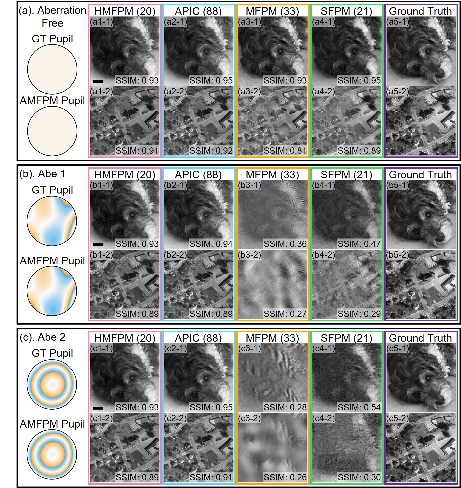

# Hybrid-illumination Multiplexed Fourier Ptychographic Microscopy (HMFPM)

This repository contains the implementation and demonstration datasets for the paper:  

**Hybrid-illumination multiplexed Fourier ptychographic microscopy with robust aberration correction**  

arXiv: [https://arxiv.org/abs/2509.05549](https://arxiv.org/abs/2509.05549)

---

## Table of Contents
- [Introduction](#introduction)
- [Repository Structure](#repository-structure)
- [Installation](#installation)
- [Usage](#usage)
- [Example Results](#example-results)
- [BiBTeX](#BiBTeX)

---

## Introduction
**Hybrid-illumination Multiplexed Fourier Ptychographic Microscopy (HMFPM)** is an advanced computational imaging framework that integrates the advantages of **multiplexed FPM** and **Analytic Pupil function with Incoherent Contrast (APIC)** methods.  

The workflow consists of two stages:

1. **Bright-field initialization**  
   - Acquire eight NA-matched measurements.  
   - Apply **Kramers–Kronig (K–K) relations** and analytic aberration extraction to reconstruct the **bright-field spectrum**.  
   - Estimate the pupil function analytically.  

2. **Dark-field multiplexed reconstruction**  
   - Record a small number of dark-field measurements with **3–6 simultaneously illuminated LEDs** in specially designed multiplexing patterns.  
   - Use a customized optimization algorithm to reconstruct the dark-field spectrum, initialized and constrained by the aberration-corrected bright-field spectrum and the extracted pupil function.
     
<p align="center">
  <table>
    <tr>
      <td></td>
      <td></td>
    </tr>
    <tr>
      <td align="center"><em>(1) Experimental setup and illumination strategy for HMFPM </em></td>
      <td align="center"><em>(2) Reconstruction pipeline for HMFPM </em></td>
    </tr>
  </table>
  <br>
</p>

**Advantages over MFPM and APIC:**  
- Significantly reduces the number of required measurements.  
- Provides robust aberration correction.  
- Ensures fast and stable convergence without tuning relaxation factors.  

---

## Repository Structure
```bash
├── Data                               # Raw simulation and experimental datasets
├── HMFPM_experiment.py                # Main pipeline for experimental data
├── HMFPM_simulation.py                # Main pipeline for simulation data
├── subfunctionAPIC                    # Subfunctions for HMFPM reconstruction
└── README.md                          # Project documentation
```
---
## Installation

1. Clone this repository to your local machine:
    ```bash
    git clone https://github.com/Magishe/HMFPM.git
    ```

2. Navigate to the project directory:
    ```bash
    cd HMFPM
    ```

3. Install the dependencies:
   To set up your environment and install all the necessary packages, run the following command:
    ```bash
    pip3 install torch==2.1.1+cu121 torchvision==0.16.1+cu121 torch-dct==0.1.6 --index-url https://download.pytorch.org/whl/cu121
    pip3 install numpy scipy matplotlib pillow h5py opencv-python
    ```


## Usage
### 1. Using the demo data
```bash

    python HMFPM_experiment.py
    python HMFPM_simulation.py
```
### 2. Construct your own data
To run HMFPM on your own data, you need to create a MATLAB v7.3 .mat file that contains the required experimental parameters and raw measurements. Save this file under the path:
```bash
Data/experiment/
```

#### Required variables in the `.mat` file

- **dpix_c:**  Camera pixel size in micrometers (e.g., 3.45 µm).

- **lambda_g:**   Illumination wavelength in micrometers (e.g., 0.520 µm).  

- **mag:**  Objective magnification (e.g., 4).
   
- **na_illu:**  Illumination numerical aperture of the NA-matching illumination (e.g., 0.1254).  

- **na_obj:**  Objective numerical aperture (e.g., 0.1310).  

- **na_rp_cal:**   Calibrated spatial frequency coordinates of system NA.
-  
- **freqXY_calib_BF**  (double, N×2)
  Calibrated spatial frequency coordinates for NA-matching LEDs.  
  It is calculated as:  

  `freqXY_calib = (patch_size * dpix_c) / (mag * lambda_g) * illumination_NA + [patch_size/2, patch_size/2]`

- **freqXY_calib_DF** (cell, 1×N_D)  
  Calibrated spatial frequency coordinates for dark-field LEDs. Here, **N_D** denotes the total number of dark-field measurements. Each cell stores a 2D `freqXY_calib` coordinate, corresponding to the set of LEDs that are illuminated simultaneously in one measurement. These coordinates are calculated using the same equation as for **freqXY_calib_BF**.  

- **I_low** (uint16, H×W×(N+N_D))  
  Raw low-resolution intensity stack, where H and W are the image dimensions (e.g., 2048×2048), **N** is the number of NA-matching measurements, and **N_D** is the number of multiplexed dark-field measurements. The first **N** frames correspond to NA-matching measurements, followed by **N_D** frames corresponding to multiplexed dark-field measurements.  

## Example results

## Simulation results
<p align="center">
  <table>
    <tr>
      <td></td>
      <td></td>
    </tr>
    <tr>
      <td align="center"><em>(1) Siemens star simulation </em></td>
      <td align="center"><em>(2) Natural image simulation </em></td>
    </tr>
  </table>
  <br>
</p>

## Experimental results
<p align="center">
  <table>
    <tr>
      <td></td>
      <td></td>
    </tr>
    <tr>
      <td align="center"><em>(1) Siemens star experiments </em></td>
      <td align="center"><em>(2) NSCLC phase sample experiments </em></td>
    </tr>
  </table>
  <br>
</p>

## BiBTeX
@misc{zhao2025hybridilluminationmultiplexedfourierptychographic,
      title={Hybrid-illumination multiplexed Fourier ptychographic microscopy with robust aberration correction}, 
      author={Shi Zhao and Haowen Zhou and Changhuei Yang},
      year={2025},
      eprint={2509.05549},
      archivePrefix={arXiv},
      primaryClass={physics.optics},
      url={https://arxiv.org/abs/2509.05549}, 
}

